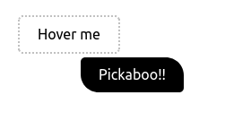
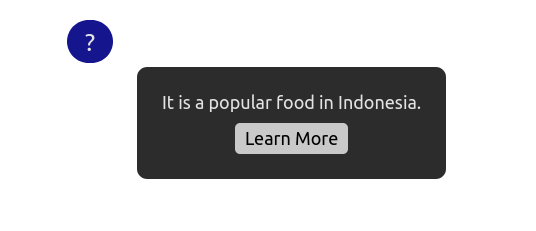

# Tooltip

A tooltip is a small popup that displays information related to an element when the user moves the mouse pointer over it.

## Screenshots

## Setup

Go to index.html file and run using any HTML previewer such as your internet browser (chrome, firefox, etc).

## Authors

👤 **Nesrya Abdulaziz**

- Github: [@NesryaAbdulakdir](https://github.com/NesryaAbdulkadir)
